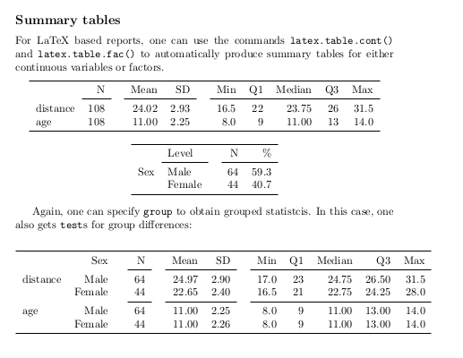

# Using package papeR
Benjamin Hofner  
Tuesday, March 17, 2015  


# A short tutorial for package **papeR**

This is a short tutorial that covers some of the features of package **papeR**.

### Installation

To install the latest development version, one can use 
**devtools** to install packages from [GitHub](http://github.com/hofnerb/papeR).


```r
install.packages("devtools")
```

Now we can load **devtools** to install **papeR**:


```r
library("devtools")
install_github("hofnerb/papeR")
```
(note that this chunk is not evaluated automatically).

### Loading the package

Now we can load the package:


```r
library("papeR")
```

### Labeled data frames

To be able to use all features of the package, we first need to 
create a labeled data frame. If we create a new data frame or 
import a data frame, we can extract and set variable labels


```r
data_orig <- data.frame(a = 1:10, 
                        b = 10:1, 
                        c = factor(sample(c(1:2), 10, replace = TRUE)))
data <- data_orig
labels(data)
```

```
##   a   b   c 
## "a" "b" "c"
```

```r
labels(data) <- c("Variable a", "Variable b", "Variable c")
is.labeled.data.frame(data)
```

```
## [1] TRUE
```

```r
labels(data)
```

```
##            a            b            c 
## "Variable a" "Variable b" "Variable c"
```

Alternatively, we can simply coerce the data frame:


```r
data2 <- as.labeled.data.frame(data_orig)
labels(data2)
```

```
##   a   b   c 
## "a" "b" "c"
```
In this case, the original labels are kept. Per default,
we use the variable names as labels. If the data set originates
from an SPSS data set and is imported imported via the function 
`read.spss()` from package **foreign**, we use the variable 
labels from SPSS. 

However, again we need to formally convert the data to a 
`labeled.data.frame` by using the function 
`as.labeled.data.frame()`.

#### Methods for labeled data frames

For data frames of class `labeled.data.frame`, there exist
special plotting functions:


```r
par(mfrow = c(2, 2))
plot(data)
```

 

As one can see, the plot type is automatically determined 
based on the data type and the axis label is defiened by
the `labels()`.

To obtain group comparisons, we can use grouped plots:


```r
par(mfrow = c(1, 2))
plot(data, by = "c")
```

 

We can as well plot everything against a metrical variable:


```r
par(mfrow = c(1, 2))
plot(data, with = "b")
```

 

### Summary tables

For LaTeX based reports, one can use the commands `latex.table.cont()` 
and `latex.table.fac()` to automatically produce summary tables for either
continuous variables or factors. 


```r
data(Orthodont, package = "nlme")
latex.table.cont(Orthodont)
latex.table.fac(Orthodont, variables = "Sex")
```

Again, one can specify `group` to obtain grouped statistcis. In this
case, one also can gets `test`s for group differences:


```r
latex.table.cont(Orthodont, group = "Sex", test = FALSE)
```

The results in LaTeX look as follows:




> **A non-latex version is currently under construction.**


### Prettify output

To prettify the output of a linear model, one can use the function
`prettify()`. This function adds confidence intervals, properly 
prints p-values, adds significance stars to the output (if desired) 
and additionally adds pretty formating for factors.


```r
linmod <- lm(distance ~ age + Sex, data = Orthodont)
## Extract pretty summary
(pretty_lm <- prettify(summary(linmod)))
```

```
##                 Estimate CI (lower) CI (upper) Std. Error   t value
## 1 (Intercept) 17.7067130 15.5014071 19.9120189 1.11220946 15.920304
## 2         age  0.6601852  0.4663472  0.8540231 0.09775895  6.753194
## 3 Sex: Female -2.3210227 -3.2031499 -1.4388955 0.44488623 -5.217115
##   Pr(>|t|)    
## 1   <0.001 ***
## 2   <0.001 ***
## 3   <0.001 ***
```

The resulting table can now be formated for printing using packages like 
**xtable** for LaTeX which can be used in `.Rnw` files with the option 
`results='asis'`


```r
library("xtable")
xtable(pretty_lm)
```

In markdown files (`.Rmd`) one can instead use the function `kable()` with the 
chunk option `results='asis'`. The result looks as follows:


```r
kable(pretty_lm)
```


|            |   Estimate| CI (lower)| CI (upper)| Std. Error|   t value|Pr(>&#124;t&#124;) |    |
|:-----------|----------:|----------:|----------:|----------:|---------:|:------------------|:---|
|(Intercept) | 17.7067130| 15.5014071| 19.9120189|  1.1122095| 15.920304|<0.001             |*** |
|age         |  0.6601852|  0.4663472|  0.8540231|  0.0977589|  6.753194|<0.001             |*** |
|Sex: Female | -2.3210227| -3.2031499| -1.4388955|  0.4448862| -5.217115|<0.001             |*** |


#### Supported objects

The function `prettify` is *currently* implemented for objects of the following classes:

* `lm` (linear models)
* `glm` (generalized linear models)
* `coxph` (Cox proportional hazards models)
* `lme` (linear mixed models; implemented in package **nlme**)
* `mer` (linear mixed models; implemented in package **lme4**, vers < 1.0)
* `merMod` (linear mixed models; implemented in package **lme4**, vers. >= 1.0)
* `anova` (anova objects)

## Outlook

This package is currently under ative development. Feature requests, bug reports, or
patches that either add new features or fix bugs are always welcome. 
Please use the [GitHub](http://github.com/hofnerb/papeR) page.
